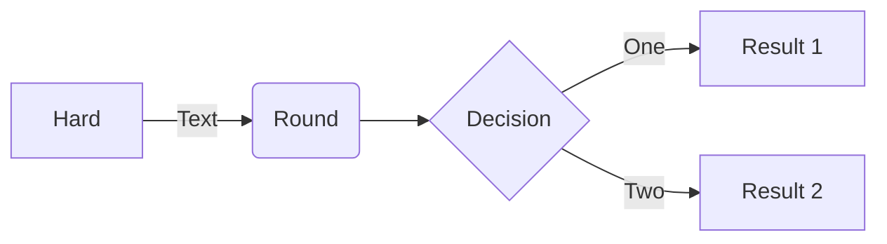

# Writing a New Post

博客基于[chripy](https://chirpy.cotes.page/posts/write-a-new-post)模板做出修改，详情请参考官方文档[^chripy]。


## 命名

命名格式必须是：`YYYY-MM-DD-TITLE.EXTENSION`的`markdown`文档，位置放在`_posts`目录内。


## 眉批(Front matter)
眉批用于定义文档中的一些必要元素，使用`yaml`语法描述，其中的属性由`jekyll`使用。一般需要包含以下类型：
- title: 文章标题
- date：YYYY-MM-DD HH:MM:SS +/-TTTT，创建时间，为了消除歧义应当添加时区，例如：`2023-10-14 20:16 +0800`
- categories: 最多可以包含2个，第一个是父类别，第二个是自类别。例如`categories: [Animal, dog]`。定义后在博客中的体现是一个目录结构。
- tags: `tags`可以有任意个

### 手动创建
直接添加一个新的`markdown`文档，然后添加`title`, `date`, `categories`, `tags`等必要信息即可。

### 快速创建
使用[Jekyll-Compose](https://github.com/jekyll/jekyll-compose)插件可以快速创建一个文档，但是其中缺少`tags`等信息。
使用方式也很简单
- 在`Genfile`内添加插件：`gem 'jekyll-compose', group: [:jekyll_plugins]`
- `shell`内根据`Gemfile`配置环境，直接执行：`$ bundle`
- 使用插件创建文档：`$ bundle exec jekyll post "My New Post"`
除了创建文档之外，Jekyll-Compose还可以生成`draft`, `pages`等，详细功能可以自行探索，一般用不到。


## 作者信息
`chirpy`支持在`_data/authors.yml`中定义多个作者，然后在`markdown`中通过`author_id`引用作者信息。

一个比较简单的作者信息例子：
```yml
<author_id>:
  name: <full name>
  twitter: <twitter_of_author>
  url: <homepage_of_author>
```
然后可以在`markdown`中的前置信息内通过`author: <author_id>`或者`author: <author1_id>, <author2_id>`添加

## 目录、评论、公式
目录(TOC, Table Of Contents)，评论默认开启，支持关闭。公式默认关闭，支持开启。
- 目录
  - 全局关闭：将`_config.yml`中的`toc`修改为`false`即可
  - 对当前文档关闭：眉批中添加`toc: false`即可
评论和公式的配置项分别为：`comments`, `math`。公式详细语法参考官方文档。


## markdown绘图：mermaid
[mermaid](https://github.com/mermaid-js/mermaid/blob/develop/README.zh-CN.md)支持使用很简单的特定语法生成图片，具体参考官方文档。
使用方法和插入代码块完全相同，对应关键字为`mermaid`，即使用```` ```mermaid ```` and ```` ``` ````包围。



## 图片
插入图片完全遵循`markdown`语法，图片链接下方的斜体字将作为图片名称显示。

```markdown

_Image Caption_
```


### 图片尺寸
```markdown
{: width="700" height="400" }
需要注意的是，***对于`svg`矢量图必须指定宽度，否则将不会渲染***。 
```

### 位置
位置默认居中，可以指定左右
```markdown
![Desktop View]`(/assets/img/sample/mockup.png)`{: .normal }
```

### 其他属性
- 图像可以适应暗/亮不同主题，但是必须指定2张图片。
```markdown
{: .light }
{: .dark }
```

### cdn图片
如果图片存在`cdn`上，那么可以通过配置`cdn`地址将对应空间添加到寻址中。修改`_config.yml`中的`img_cdn: https://cnd.com`后，可以直接使用`![my panda]/path/to/panda.png`的方式引用图片。最终图片地址会解析为：``

### 本地图片
对于本地图片，可以在眉批添加`img_path: /img/path`，然后直接在`markdown`中使用``引用，最终图片会解析为：``

### 预览图片

支持点击链接前的预览图片，图片长宽比应当为`1.91:1`，即`1200 * 630`，否则会被缩放 / 裁剪。
只需要在眉批添加`image`即可。
```markdown
预览图
---
image:
  lqip: /path/to/lqip-file # or base64 URI
---

正文中显示的图
{: lqip="/path/to/lqip-file" }

```

## 固定特定文章

通过添加`pin: true`可以将文章有限排序在顶部，所有启用`pin`的文章按照日期降序排列，然后显示其他文章。


## 提示
可以添加`tip`, `info`, `warning`, `danger`提示信息，使用方式是：`{: .prompt-info}`

```markdown
> info prompt example.
{: .prompt-info}
```

最终效果：
> info prompt example.
{: .prompt-info}


## 代码块
代码块即`markdown`语法中的代码块，使用```` ```language ``` ````包含
代码块默认名字为语法名字，如果需要修改文件名需要在代码块下方添加`{: file='file_name'}`。
```cpp
imt main() {
  std::print("hello world");
  return 0;
}
```
{: file="demo/main.cc" }

突出显示文件路，效果类似于 `***`包含的内容
```markdown
`/path/to/a/file.extend`{: .filepath}
```
`/path/to/a/file.extend`{: .filepath}

## 脚注
脚注是标准`markdown`支持的语法，使用时在方括号内添加标识符并在冒号后添加文本：`[^id]: simple footnote.`。


# 参考文献
[^chripy]: 一个经典的博客模板，地址为：https://chirpy.cotes.page/
[^olimi]:一些关于markdown和chirpy主题的介绍：https://www.cnblogs.com/olimi/p/16173745.html

